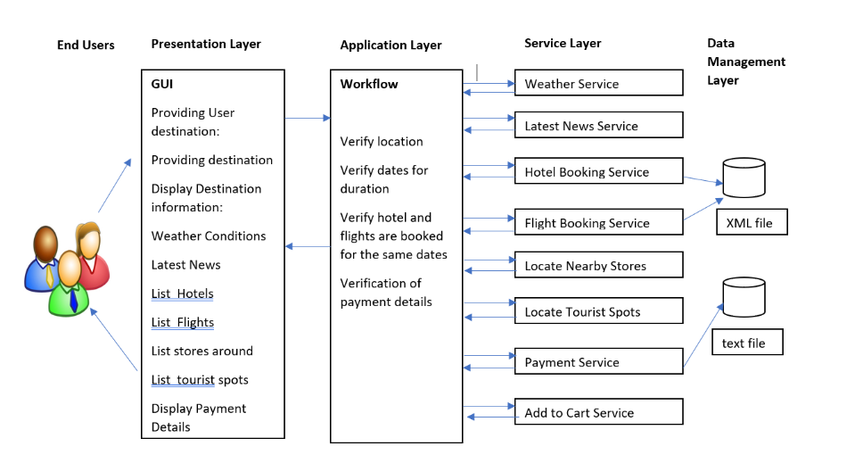

# TripPlanner
End to End Application which helps tourist in planning a trip from booking flight tickets to finding best tourist attractions.

## 1.1 Project Idea : Description

This project is a holiday planning application that makes it easier to plan trips in a matter of few minutes.By deciding on a destination a user can retrieve  it’s weather conditions , latest news , book hotels and flights for the best price, Identify tourist locations,identify stores close to your hotel and finally receive a confirmation in minutes.It offers a complete package of services for all kinds of travellers.
A user can put in his travel destination and also the duration of his stay.As soon as the location is taken it displays the weather conditions in that location along with the latest news to identify any natural hazards or riots .He can continue with the same destination or change his destination based on the above information.On selecting a destination the user can book hotel and flight tickets .He can either choose to book hotel and flight or either one.On choosing the hotel ,he will be provided with a list of stores and tourist locations close by.Once he confirms his destination he can checkout and receive an estimate of his trip.If this amount is within his budget he can go ahead and make payment using payment service or start again by changing hotel or his destination.

Try these Services:
http://webstrar30.fulton.asu.edu/page5/ToursitLocatorTryIt

